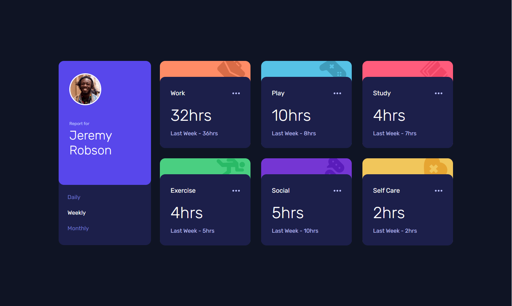
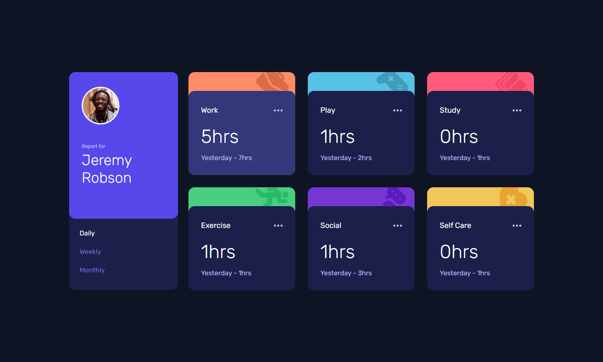
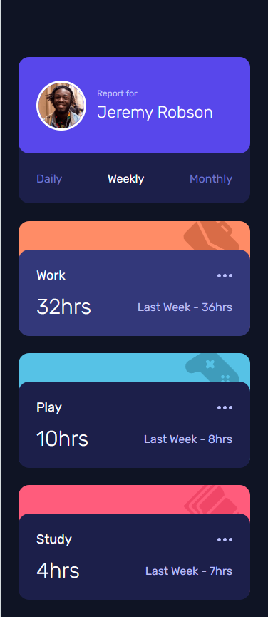

# Frontend Mentor - Time tracking dashboard solution

This is a solution to the [Time tracking dashboard challenge on Frontend Mentor](https://www.frontendmentor.io/challenges/time-tracking-dashboard-UIQ7167Jw). Frontend Mentor challenges help you improve your coding skills by building realistic projects. 

## Table of contents

- [Overview](#overview)
  - [The challenge](#the-challenge)
  - [Screenshot](#screenshot)
  - [Links](#links)
- [My process](#my-process)
  - [Built with](#built-with)
  - [What I learned](#what-i-learned)
- [Author](#author)

## Overview

### The challenge

Users should be able to:

- View the optimal layout for the site depending on their device's screen size
- See hover states for all interactive elements on the page
- Switch between viewing Daily, Weekly, and Monthly stats

### Screenshot

## Desktop Design

## Mobile Design

### Links

- Live Site URL: [Time Tracking Dashboard](https://rkendall300.github.io/time-tracking-dashboard/)

## My process

### Built with

- Semantic HTML5 markup
- CSS custom properties
- Flexbox
- CSS Grid
- Mobile-first workflow
- [React](https://reactjs.org/) - JS library

### What I learned

This was my first project fully utilizing the json data provided by Frontend Mentor. I honestly didn't even notice that there were different displays for daily, weekly, and monthly selections, I just figured it was there for the hover state as shown in the active-states picture provided. After reading the README I saw that it was supposed to swap the data in and out, and decided to try and learn how to use json files. I think it turned out pretty well! Very happy with the result.

## Author

- Frontend Mentor - [@rkendall300](https://www.frontendmentor.io/profile/rkendall300)